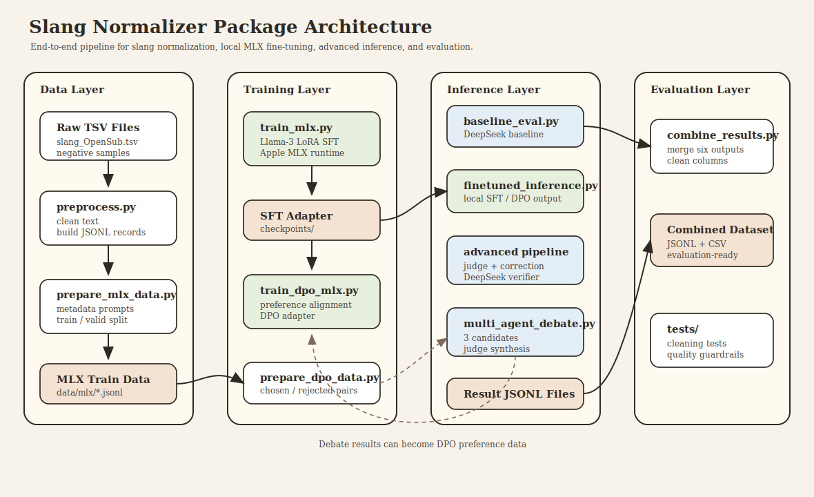

# Slang Normalizer

Slang Normalizer is a Python package for normalizing informal English slang into
formal English. The project builds an end-to-end NLP workflow that starts from
raw slang datasets, converts them into instruction-tuning data, fine-tunes a
local Llama-3 model with Apple MLX, compares multiple inference strategies, and
exports a combined evaluation dataset.

The high-level research question is:

> Can a local fine-tuned Llama-3 model normalize slang into formal English, and
> can judge-guided inference or preference alignment improve the result?

## Package Architecture

The package is organized around four connected layers: data preparation,
training, inference, and evaluation.



The editable draw.io source file is available at
[`docs/architecture.drawio`](docs/architecture.drawio).

## Key Features

- Clean raw slang data by lowercasing, removing punctuation, and reducing
  repeated characters.
- Convert slang examples into Llama-3 instruction-tuning JSONL format.
- Prepare Apple MLX-compatible train and validation datasets.
- Fine-tune Llama-3 locally with LoRA using `mlx-lm`.
- Run six evaluation pipelines:
  - DeepSeek zero-shot baseline
  - Local fine-tuned Llama-3 inference
  - Advanced back-translation and self-correction
  - Multi-agent debate inference
  - DPO-aligned inference
  - DPO plus advanced self-correction
- Merge all model outputs into one evaluation-ready JSONL and CSV file.

## Project Layout

```text
slang_normalizer/
├── docs/
│   ├── architecture.svg
│   └── architecture.drawio
├── src/
│   └── slang_normalizer/
│       ├── preprocess.py
│       ├── prepare_mlx_data.py
│       ├── train_mlx.py
│       ├── baseline_eval.py
│       ├── finetuned_inference.py
│       ├── advanced_with_backtranslation.py
│       ├── multi_agent_debate.py
│       ├── prepare_dpo_data.py
│       ├── train_dpo_mlx.py
│       └── combine_results.py
├── tests/
│   └── test_cleaning.py
├── pyproject.toml
└── uv.lock
```

The project-level `data/` directory stores the source datasets, processed
training data, model outputs, and final combined evaluation files.

## Installation

This project uses `uv` for dependency management.

```bash
uv sync
```

The DeepSeek API key should be stored in the project root `.env` file:

```text
DEEPSEEK_API_KEY=your_key_here
```

The `.env` file is intentionally ignored by Git.

## Demonstration of Key Features

### 1. Build the Instruction Dataset

Convert the raw TSV files into Llama-3 instruction-style JSONL data.

```bash
uv run python src/slang_normalizer/preprocess.py
```

This produces:

```text
../data/slang_open_sub_llama3.jsonl
```

### 2. Prepare MLX Training Data

Create MLX-compatible train and validation splits while holding out the test
examples used for evaluation.

```bash
uv run python src/slang_normalizer/prepare_mlx_data.py
```

This produces:

```text
../data/mlx/train.jsonl
../data/mlx/valid.jsonl
```

### 3. Fine-Tune the Local Llama-3 Model

Generate the MLX LoRA configuration:

```bash
uv run python src/slang_normalizer/train_mlx.py
```

Run training:

```bash
uv run python src/slang_normalizer/train_mlx.py --run
```

The trained LoRA adapter is saved under:

```text
checkpoints/llama3_slang_lora/
```

### 4. Run the DeepSeek Baseline

```bash
uv run python src/slang_normalizer/baseline_eval.py
```

This produces:

```text
../data/results_baseline.jsonl
```

### 5. Run Local Fine-Tuned Inference

```bash
uv run python src/slang_normalizer/finetuned_inference.py
```

This produces:

```text
../data/results_finetuned.jsonl
```

### 6. Run Advanced Self-Correction

This pipeline uses local Llama-3 for translation and DeepSeek as a semantic
judge. If the judge rejects the first translation, the local model receives one
correction attempt.

```bash
uv run python src/slang_normalizer/advanced_with_backtranslation.py
```

This produces:

```text
../data/results_advanced.jsonl
```

### 7. Run Multi-Agent Debate

This pipeline generates three local candidate translations, then asks DeepSeek
to critique them and synthesize the best final answer.

```bash
uv run python src/slang_normalizer/multi_agent_debate.py
```

This produces:

```text
../data/results_debate.jsonl
```

### 8. Prepare and Train DPO

Build preference pairs from generated debate results:

```bash
uv run python src/slang_normalizer/prepare_dpo_data.py
```

Train a DPO adapter:

```bash
uv run python src/slang_normalizer/train_dpo_mlx.py
```

DPO adapter checkpoints are saved under:

```text
checkpoints_dpo/
```

### 9. Merge Evaluation Results

After all six result files are generated, merge them into one compact
evaluation dataset.

```bash
uv run python src/slang_normalizer/combine_results.py
```

This produces:

```text
../data/results_combined_for_evaluation.jsonl
../data/results_combined_for_evaluation.csv
```

The combined file contains:

- `id`
- `original_slang`
- `ground_truth`
- `baseline_output`
- `finetuned_output`
- `advanced_output`
- `debate_output`
- `dpo_output`
- `dpo_advanced_output`

## Inference Pipelines

### Baseline

The baseline sends each test sentence directly to DeepSeek-V3 using a zero-shot
prompt and saves the formal rewrite.

### Fine-Tuned

The fine-tuned pipeline loads the local Llama-3 model with the SFT LoRA adapter
and generates a formal rewrite using a metadata-aware prompt.

### Advanced

The advanced pipeline first generates a local translation, sends it to DeepSeek
for semantic verification, and performs one self-correction attempt when needed.

### Debate

The debate pipeline asks the local model for three candidate translations, then
uses DeepSeek to critique and synthesize the best final output.

### DPO

The DPO pipeline builds preference pairs from previous generated outputs and
trains a preference-optimized adapter on top of the SFT model.

### DPO + Advanced

This pipeline uses the DPO adapter inside the same judge-guided self-correction
framework as the advanced pipeline.

## Quality Checks

Run tests:

```bash
uv run pytest tests
```

Run linting:

```bash
uv run ruff check .
```

Check formatting:

```bash
uv run ruff format --check .
```

## Notes and Known Challenges

- The Llama-3 base model may require Hugging Face gated model access.
- DeepSeek calls require a valid `DEEPSEEK_API_KEY`.
- DPO training is experimental and sensitive to preference data quality.
- The project uses the first 200 processed examples as the shared evaluation
  set to reduce API cost and runtime.
- The original result files are preserved; merged evaluation files are generated
  separately.
